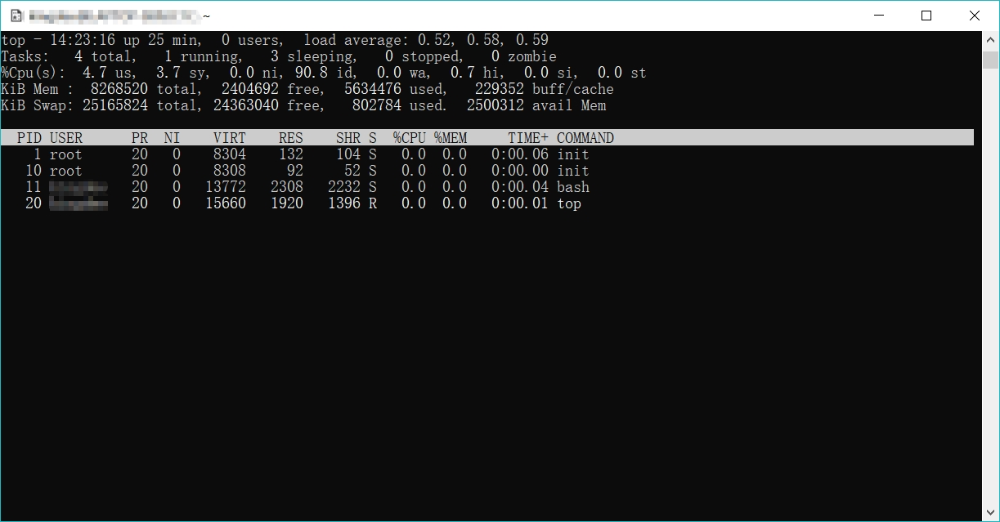

# top 命令 #

`top` 命令和 `ps` 命令相似，能够显示进程信息，但它是实时的：

``` bash
gackle@machine:~$ top
```



## 输出结果解析 ##


输出的第一部分显示的是**系统的概况**。

第一行显示了<u>当前时间、系统的运行时间、登陆的用户数以及系统的平均负载</u>。

其中**平均负载**有 3 个值：最近 1 分钟的、最近 5 分钟的和最近 15 分钟的平均负载。值越大说明系统的负载越高。由于进程短期的突发性活动，出现最近 1 分钟的高负载值也很常见，但如果近 15 分钟内平均负载都很高，那就说明系统可能有问题。

> <small>通常，如果系统的负载超过了 2，就说明系统比较繁忙了。</small>

第二行显示了<u>进程概要信息 —— `top` 命令的输出中将进程叫做**任务**（task）：有多少进程处于运行、休眠、停止或是僵化状态</u>（僵化状态时指进程完成了，但父进程没有响应）。

第三行显示了<u>CPU 的概要信息</u>。`top` 根据进程的属主（用户还是系统）和进程的状态（运行、空闲还是等待）将 CPU 利用率分成几类输出。

后两行说明了<u>系统内存的状态</u>。前一行说的是**系统的物理内存**：总共有多少内存，当前用了多少，还有多少空闲。后一行说的是同样的信息，不过是针对**系统交换空间**（如果分配了的话）的状态而言的。

---

第二部分显示了**当前运行中的进程的详细列表**，有些列和 `ps` 命令有些类似。

- PID：进程的 ID。
- USER：进程属主的名字。
- PR： 进程的优先级。
- NI：进程的谦让度值。
- VIRT：进程占用的虚拟内存总量。
- RES：进程占用的物理内存总量。
- SHR：进程和其他进程共享的内存总量。
- S：进程的状态（D 代表可中断的休眠状态，R 代表在运行状态，S 代表休眠状态，T 代表跟踪状态或停止状态，Z 代表僵化状态）。
- %CPU：进程使用的 CPU 时间比例。
- %MEM：进程使用的内存占可用内存的比例。
- TIME+：自进程启动到目前为止的 CPU 时间总量。
- COMMAND：进程所对应的命令行名称，也就是启动的程序名。

> <small>默认情况下，`top` 命令在启动时会按照 `%CPU` 值对进程进行排序

## 交互式改变 `top` 行为

- 键入 `f` 允许选择对输出进行排序的字段；
- 键入 `d` 运行修改该轮询间隔；
- 键入 `q` 可以退出 `top`。